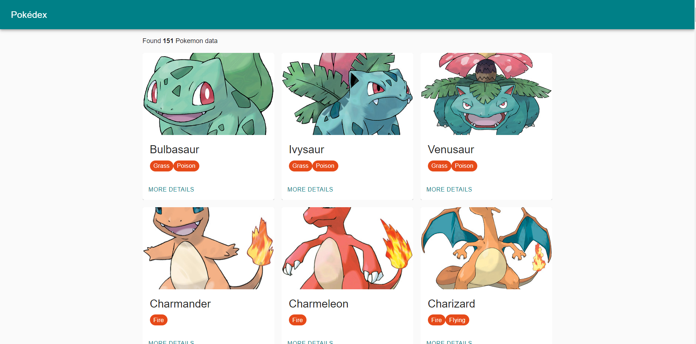

# Pokédex sample app bootstrapped with CRA

[](https://app.netlify.com/sites/pokedex-yasintze/deploys)

An example of a simple Pokédex web apps built in React on Create React App. Using

Live Preview : https://pokedex-yasintze.netlify.com/



Screenshot Preview

### Access Locally

```
$ git clone https://github.com/yasintze/pokedex.git
$ cd pokedex
$ yarn install
$ yarn run start
```

### Run Test

```
$ yarn test
```

### Consume API/GraphQL
https://graphql-pokemon.now.sh/

### To-Do

Testing need more improvement!

### License

Released under the MIT License. Check `LICENSE` file for more info.